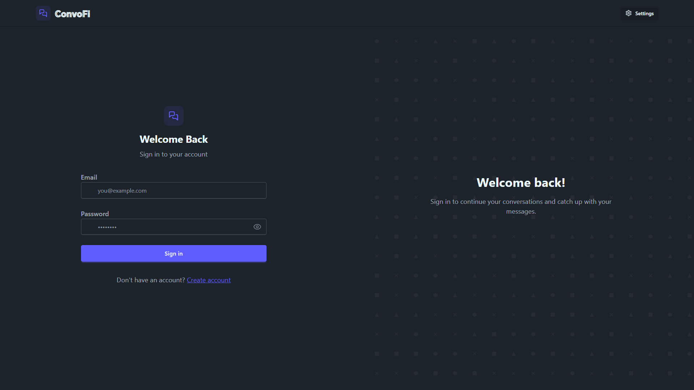
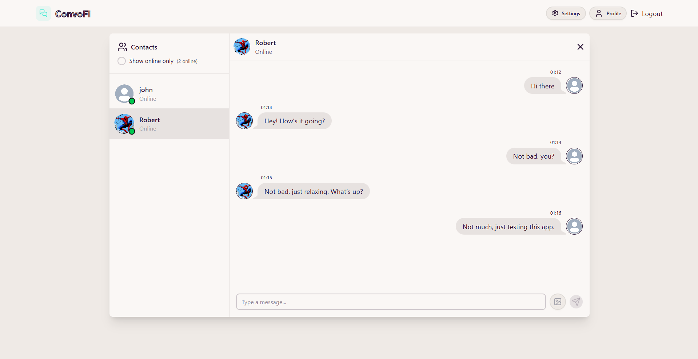
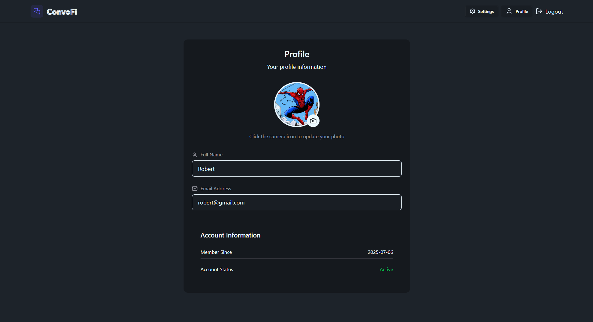
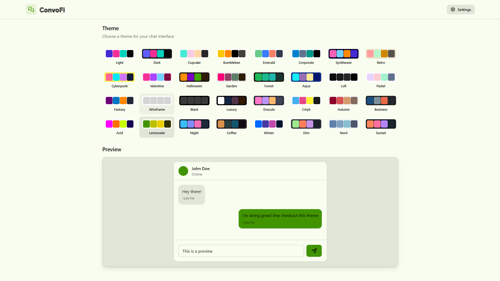

# ConvoFi

Convofi is a real-time chat app built using the MERN stack, with a clean UI powered by DaisyUI and real-time communication handled by Socket.IO. You can chat with friends, see who's online, and enjoy a smooth, fast experience.


---

## Features

- Secure login with JWT authentication
- Real-time one-on-one via Socket.IO
- Online/offline status tracking
- Image uploads with Cloudinary
- Multi theme support using DaisyUI
- Fully modular MERN stack setup
- Zustand for state management


---

## 🖼️ Screenshots
<h3 align="center">Login Page</h3>
<p align="center">
  
</p>

<h3 align="center">Chatting UI</h3>
<p align="center">
  
</p>

<h3 align="center">Profile Page</h3>
<p align="center">
  
</p>

<h3 align="center">Themes Page</h3>
<p align="center">
  
</p>


---

## Tech Stack Used

### Frontend
- React
- TailwindCSS
- DaisyUI
- Socket.IO Client

### Backend
- Node.js
- Express.js
- MongoDB (via Mongoose)
- Socket.IO Server


## 🛠️ Getting Started

### 1. Clone the Repository

```bash
git clone https://github.com/baseer4/convofi.git
cd convofi
```

### 2. Backend Setup
```bash
cd backend
npm install
npm run dev
```

### 3. Frontend Setup
```bash
cd Frontend
npm install
npm run dev
```
